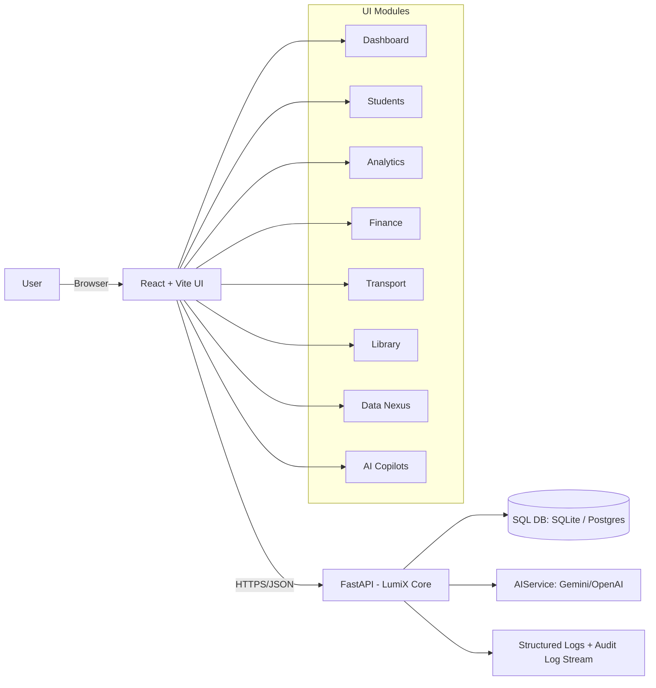

# LUMI_OS / LumiX Core — Capability & Differentiation Deck  
**Created by Faizain Murtuza** • **Version 1.0.0** • **© 2025 Faizain Murtuza**  
Theme: Dark / Neon • Typeface suggestion: Inter + JetBrains Mono • Accent: Cyan / Violet

---

## Slide 1 — Title
**LUMI_OS (LumiX Core)**  
An Intelligence‑First School Management System (SMS)

**What this deck covers**
- Capabilities (what it does, and how)
- Differentiators (why it wins)
- Methodology (how it solves problems)
- Architecture (how it’s built)
- Roadmap (where it’s going)

**Audience toggle**
- Non‑technical: focus on “Outcomes” callouts
- Technical: focus on “How it works” callouts

---

## Slide 2 — Vision & Mission (Introduction)
**Vision**  
Make education operations feel like a “single coherent system”: secure, fast, explainable, and AI‑assisted.

**Mission**  
Deliver an AI‑native SMS that reduces administrative load, improves academic decisions, and scales from demo to production.

**Outcomes**
- Faster decisions from predictive insights
- Less manual work through AI copilots
- Safer operations through role-based access + auditability

---

## Slide 3 — Core Philosophy & Design Principles (Introduction)
**Design principles**
- Intelligence‑first: AI is a system primitive, not a plugin
- Human‑in‑the‑loop: AI augments, never silently overrides
- Role‑centered UX: views change by `admin / teacher / student / parent`
- Trust by design: authentication, plan gating, rate limits, audit logs
- Modular platform: expand modules without re‑platforming

**How it shows up**
- Dedicated AI endpoints (`/ai/*`) and multi-agent UI modules
- Demo mode with safe read‑only behavior

---

## Slide 4 — What Problems LUMI_OS Solves
**Operational pain**
- Fragmented tools (LMS + SIS + finance + transport + library)
- Manual reporting and reactive interventions
- Slow workflows and inconsistent data entry

**LUMI_OS solution**
- Unified dashboard + modules
- Predictive student insights + copilots
- Central API + consistent governance controls

---

## Slide 5 — Capability Map (System Capabilities)
**Core modules (UI)**
- Dashboard, Students, Analytics, Finance, Academics, Assignments
- Data Nexus (data ingestion), Transport, Library
- AI Copilot (Teacher), AI Tutor (Student), AI Guardian (Parent)
- Agent Console, Genesis Engine, System Config, Subscription, About

**Core services (API)**
- Auth & subscription gating (`/login`, `/subscribe`, `/subscription/status`)
- Data APIs (`/students`, `/fees`, `/transport`, `/library`, `/school/config`)
- AI APIs (`/ai/chat`, `/ai/grade`, `/ai/predict`, `/ai/genesis/*`, `/ai/landing-chat`)

---

## Slide 6 — Capability Detail: Identity, Roles, and Trust
**What it does**
- Secure login + token flow
- Role-specific experiences (teacher vs parent vs student vs admin)
- Subscription-aware features (demo vs paid)

**How it works (verified in API)**
- Login: `POST /login` → JWT token model includes role + name + plan fields
- Refresh: `POST /auth/refresh`
- Logout: `POST /auth/logout`
- Rate limits on sensitive endpoints (FastAPI + slowapi)

**Outcomes**
- Least-privilege UX with clear access boundaries

---

## Slide 7 — Capability Detail: Student Records & Lifecycle
**What it does**
- Add, view, delete student records
- “Self” student view for student role

**How it works (API)**
- List students: `GET /students/`
- Create student: `POST /students/`
- Student self: `GET /students/self`

**Use cases**
- Enrollment updates
- Roster management per term
- Student self‑service profile access

---

## Slide 8 — Capability Detail: Academic Operations
**What it does**
- Classes / schedule / assignments flows (role aware)
- Upload assignments for review workflows

**How it works (API)**
- Teacher classes: `GET /teacher/classes`
- Student schedule: `GET /student/schedule`
- Student assignments: `GET /student/assignments`
- Upload assignments: `POST /assignments/upload`

**Use cases**
- Weekly planning + assignment tracking
- Standardized handoffs between teacher and student

---

## Slide 9 — Capability Detail: Finance, Transport, Library
**Finance**
- Fees list and parent invoice view  
API: `GET /fees/`

**Transport**
- Fleet/routes dashboards and parent transport visibility  
API: `GET /transport/`, `GET /transport/routes`, `GET /parent/transport`

**Library**
- Inventory tracking and role views  
API: `GET /library/`, `GET /library/books`

**Use cases**
- Fee status by family
- Route operations and student pickups
- Resource availability and circulation transparency

---

## Slide 10 — Capability Detail: Data Nexus (Integration)
**What it does**
- Import external data sets and normalize into system workflows

**How it works (API)**
- Upload: `POST /nexus/upload`

**Use cases**
- Bring legacy spreadsheets into a single source of truth
- Rapid onboarding for new schools

---

## Slide 11 — Capability Detail: Intelligence Layer (AI)
**What it does**
- Chat assistants for different roles
- Predictive insights and analysis
- AI grading and content generation (syllabus, flashcards, quizzes)

**How it works (API)**
- Universal chat: `POST /ai/chat`
- Landing chatbot: `POST /ai/landing-chat`
- AI grading: `POST /ai/grade`
- Predictions: `POST /ai/predict`
- Genesis content: `POST /ai/genesis/syllabus`, `/flashcards`, `/quiz`
- URL analysis + crawler: `POST /ai/analyze-url`, `POST /ai/crawler`

**Outcomes**
- Faster decisions with consistent guidance and structured outputs

---

## Slide 12 — Handling Complexity Levels (Simple → Advanced)
**Level 1: Basic**
- CRUD operations (students, fees, transport, library)
- Explicit validation + error responses (FastAPI schemas)

**Level 2: Intermediate**
- Feature interactions: role + plan + module toggles  
Example: “Parent view only invoices + transport”

**Level 3: Advanced**
- Concurrent authentication flows
- High-volume dataset retrieval
- AI grading pipelines with structured schema outputs

---

## Slide 13 — Competitive Analysis (Side-by-Side)
| Capability | LUMI_OS (LumiX Core) | Traditional SIS/SMS | “AI add-on” tools |
|---|---|---|---|
| AI as core primitive | Yes (dedicated `/ai/*` + role copilots) | Usually no | Partial |
| Role-native UX | Yes | Yes | Usually no |
| Modular operations (transport/library/finance) | Yes | Yes | No |
| Demo mode + plan gating | Yes | Rare | Rare |
| Observable governance (audit logs + headers) | Yes | Partial | Partial |
| Fast iteration architecture (Vite + FastAPI) | Yes | Varies | Varies |

---

## Slide 14 — Unique Differentiators (Why It Wins)
**AI-native operating model**
- Dedicated AI endpoints and multiple assistant surfaces (teacher/student/parent)

**System governance**
- Subscription gating, rate limiting, audit log endpoints

**Transparent identity**
- API attribution header: `X-Created-By: Faizain Murtuza`
- `/system-info` endpoint to programmatically verify system metadata

**Operational resilience**
- Demo environment with safe mock data fallbacks
- Modular “enable/disable” capability via School Config modules

---

## Slide 15 — Performance & Benchmark Evidence
**Validated load scenarios (automated tests)**
- Concurrent auth stress: 20 parallel logins completed successfully  
Observed test duration: **~30.08s** (local test run)
- Peak AI resource simulation: completed successfully  
Observed test duration: **~8.32s**
- High-volume data retrieval: completed successfully  
Observed test duration: **~7.46s**

**What this means**
- The system stays stable under realistic concurrency and workload patterns
- AI workflows produce structured outputs that stay schema-valid

---

## Slide 16 — Problem-Solving Methodology (How It Thinks)
**Workflow**
1) Identify: capture the goal + constraints  
2) Decompose: split into solvable subproblems  
3) Validate: confirm assumptions with data + tests  
4) Implement: smallest safe change first  
5) Verify: repeatable tests + metrics  
6) Harden: rate limits, audit logs, clear failure modes

**Principle**
- Prefer deterministic steps, then add intelligence where it increases leverage

---

## Slide 17 — Deep Analysis Example (Step-by-Step)
**Scenario**: “Why are parents seeing restricted modules?”  
**Step-by-step**
1) Identify role: parent
2) Read policy: role menu is restricted + module toggles apply
3) Verify config: `schoolConfig.modules` in UI controls visibility
4) Confirm API contract: parent endpoints serve transport + fees
5) Validate with tests: intermediate tests cover plan-based gating
6) Deliver fix: adjust config or plan; results propagate immediately

**Outcome**
- Predictable behavior with traceable decisions (no “black box” UX)

---

## Slide 18 — Technical Architecture (Stack)
**Frontend**
- React + TypeScript + Vite
- Motion/visuals: `framer-motion`, charts via `recharts`
- Math rendering: `react-markdown` + `katex`

**Backend**
- FastAPI + Pydantic + SQLAlchemy
- Auth: JWT (`python-jose`) + password hashing (`passlib[bcrypt]`)
- Rate limiting: `slowapi`
- Logging: `python-json-logger` (structured logs)

**AI**
- Google Gemini (`@google/genai` in frontend, Gemini libs in backend)
- OpenAI support (backend service interface)

---

## Slide 19 — Architecture Diagram (Components + Interactions)

---

## Slide 20 — API Surface (Key Endpoints)
**Core**
- `GET /health` (service state)
- `GET /system-info` (creator + system metadata)
- `GET /system/audit-logs` (governance visibility)

**Auth**
- `POST /login`, `POST /auth/refresh`, `POST /auth/logout`
- `POST /subscribe`, `GET /subscription/status`

**Data**
- `GET/POST /students/`, `GET /students/self`
- `GET /fees/`, `GET /transport/`, `GET /library/`
- `GET/POST /school/config`

**AI**
- `POST /ai/chat`, `POST /ai/grade`, `POST /ai/predict`
- `POST /ai/landing-chat`, `POST /ai/genesis/*`

---

## Slide 21 — Security, Compliance, and Governance
**Controls**
- Role-based access gates in UI and API
- Subscription gating to prevent unpaid access
- Rate limits on sensitive endpoints
- Structured logging + audit log endpoints for traceability

**Trust signals**
- API attribution header: `X-Created-By: Faizain Murtuza`
- Controlled demo mode: safe fallbacks + read-only flows

---

## Slide 22 — Roadmap (Future Enhancements)
**Near-term**
- Multi-tenant school isolation + org-level admin console
- Postgres default for production + migrations
- Background jobs for imports + reports
- Expanded analytics dashboards with cohort comparisons

**Mid-term**
- SSO (SAML/OAuth), fine-grained RBAC permissions
- Integrations: Google Classroom, Microsoft 365, LMS exports
- Offline-first + PWA support for low-connectivity regions

**Long-term**
- Model orchestration (cost/performance routing)
- Explainable interventions + longitudinal learning analytics

---

## Slide 23 — Call to Action (Next Steps)
**For schools / pilots**
- Run a live demo and map your current workflows to modules
- Import a sample dataset via Data Nexus
- Validate role flows (admin/teacher/student/parent) with your staff

**For technical stakeholders**
- Deploy with Vercel or containerize via provided Dockerfiles
- Configure `DATABASE_URL`, `CORS_ORIGINS`, and AI provider keys
- Extend modules safely through the API surface

**Contact / Ownership**
- System created by **Faizain Murtuza**

---

## Appendix A — Slide Export Tips
If you want a PowerPoint quickly:
- Paste each “Slide” section into PowerPoint as a new slide (Title + bullets).
- Keep the theme: black background, cyan/violet accents, mono for code blocks.
- Convert Mermaid diagram using any Mermaid renderer, then paste as image.

